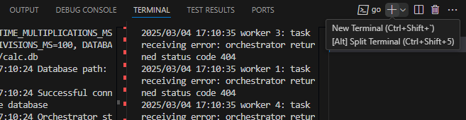

# calculator-with-authorization

## О проекте

Распределённый вычислитель арифметических выражений является итоговым проектом для обучающего курса Yandex Lyceum Программирование на Go | 24

[Web-calculator-golang](https://github.com/bulbosaur/web-calculator-golang) - предыдущая версия

## GUI

Если переменныем окружения не были изменены, графический интерфейс доступен по адресу ```http://localhost:8080```

У пользователя есть возможность зарегистрироваться или войти в уже существующий аккаунт при помощи логина и пароля. После этого происходит переадресация на страницу самого калькулятора

- Поддерживаются операции сложения, вычитания, умножения и деления, а также выражения в скобках
- Выражение может вводиться как с пробелами между числом и операндом, так и без
- Калькулятор принимает на вход положительные целые числа

## Зависимости

- Go версии ```1.23``` или новее
- Дополнительные библиотеки (указаны в ```go.mod```)

## Установка

1. Клонирование репозитория

```bash
git clone https://github.com/bulbosaur/calculator-with-authorization
```

2. Установка зависимостей

```bash
go mod tidy
```

3. Запуск сервера из репозитория проекта

Необходимо находиться в корневой директории проекта (calculator-with-authorization)

Для запуска двух сервисов Вам потребуется 2 терминала. В **Visual Studio Code** удобно открыть сплит сочетанием клавиш ```Ctrl+Shift+5```.



- В первом необходимо ввести команду:

```bash
go run ./cmd/orchestrator/main.go
```
Дождитесь запуска сервера, при первом старте это может занять довольно много времени:

```bash
2025/05/10 17:08:39 Starting server...
2025/05/10 17:08:39 Configuration: HTTP_HOST=localhost, HTTP_PORT=8080, GRPC_HOST=localhost, GRPC_PORT=50051, TIME_ADDITION_MS=100, TIME_SUBTRACTION_MS=100, TIME_MULTIPLICATIONS_MS=100, TIME_DIVISIONS_MS=100, DATABASE_PATH=./db/calc.db, jwt.token_duration=24
2025/05/10 17:08:39 Database path: ./db/calc.db
2025/05/10 17:08:39 Successful connection to the database
2025/05/10 17:08:39 HTTP orchestrator starting on localhost:8080
2025/05/10 17:08:39 Starting gRPC server...
2025/05/10 17:08:39 gRPC server listening on localhost:50051
```

- А во втором:

```bash
go run ./cmd/agent/main.go
```


## Переменные окружения

| Переменная                             | Описание                                            | Значение по умолчанию |
|----------------------------------------|-----------------------------------------------------|-----------------------|
| ```server.HTTP_PORT```                 | Порт для запуска HTTP сервера                       | 8080                  |
| ```server.HTTP_HOST```                 | Хост для запуска HTTP сервера оркестратора          | localhost             |
| ```server.GRPC_PORT```                 | Порт для запуска gPRC сервера                       | 50051                 |
| ```server.GRPC_HOST```                 | Хост для запуска gRPC сервера                       | localhost             |
| ```duration.TIME_ADDITION_MS```        | Время выполнения операции сложения в миллисекундах  | 100                   |
|```duration.TIME_SUBTRACTION_MS```      | Время выполнения операции вычитания в миллисекундах | 100                   |
| ```duration.TIME_MULTIPLICATIONS_MS``` | Время выполнения операции умножения в миллисекундах | 100                   |
| ```duration.TIME_DIVISIONS_MS```       | Время выполнения операции деления в миллисекундах   | 100                   |
| ```DATABASE_PATH```                    | Путь к базе данных                                  |./db/calc.db           |
| ```worker.COMPUTING_POWER```           | Количество горутин, выполняющих вычисления          | 5                     |
| ```jwt.secret_key```                   | Используется для создания цифровой подписи токена   | your_secret_key_here  |
| ```jwt.token_duration```               | Время жизни токена                                  | 24                    |

## Тестирование

```bash
go test -cover .\internal\agent\

# ok        coverage: 67.9% of statements
```

```bash
go test -cover .\internal\auth\

# ok        coverage: 89.5% of statements
```
```bash
go test -cover .\internal\orchestrator\transport\http\handlers\

# ok        coverage: 65.3% of statements
```
```bash
go test -cover .\internal\orchestrator\transport\grpc\

# ok        coverage: 67.9% of statements
```
```bash
go test -cover .\internal\orchestrator\service\ 

# ok        coverage: 88.6% of statements
```
```bash
go test -cover .\internal\orchestrator\transport\http\middlewares\

# ok        coverage: 84.2% of statements
```
```bash
go test -cover .\internal\repository\

# ok        coverage: 63.2% of statements
```


```bash
        github.com/bulbosaur/calculator-with-authorization/cmd/agent            coverage: 0.0% of statements
?       github.com/bulbosaur/calculator-with-authorization/internal/models      [no test files]
        github.com/bulbosaur/calculator-with-authorization/config               coverage: 0.0% of statements
        github.com/bulbosaur/calculator-with-authorization/cmd/orchestrator             coverage: 0.0% of statements
ok      github.com/bulbosaur/calculator-with-authorization/internal/agent       (cached)        coverage: 66.7% of statements
ok      github.com/bulbosaur/calculator-with-authorization/internal/auth        (cached)        coverage: 89.5% of statements
        github.com/bulbosaur/calculator-with-authorization/internal/mock                coverage: 0.0% of statements
        github.com/bulbosaur/calculator-with-authorization/internal/orchestrator/transport/http         coverage: 0.0% of statements
        github.com/bulbosaur/calculator-with-authorization/proto                coverage: 0.0% of statements
ok      github.com/bulbosaur/calculator-with-authorization/internal/orchestrator/service        0.541s  coverage: 88.6% of statements
ok      github.com/bulbosaur/calculator-with-authorization/internal/orchestrator/transport/grpc 0.177s  coverage: 67.9% of statements
ok      github.com/bulbosaur/calculator-with-authorization/internal/orchestrator/transport/http/handlers        0.547s    coverage: 65.3% of statements
ok      github.com/bulbosaur/calculator-with-authorization/internal/orchestrator/transport/http/middlewares     (cached)  coverage: 84.2% of statements
ok      github.com/bulbosaur/calculator-with-authorization/internal/repository  0.642s  coverage: 63.2% of statements
```