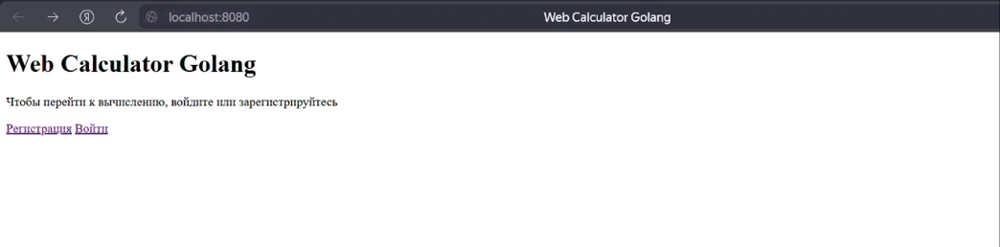

# calculator-with-authorization

## О проекте

Распределённый вычислитель арифметических выражений является итоговым проектом для обучающего курса Yandex Lyceum Программирование на Go | 24

[Web-calculator-golang](https://github.com/bulbosaur/web-calculator-golang) - предыдущая версия


- [Функционал](#функционал)
- [Принцип работы](#принцип-работы)
- [GUI](#gui)
- [Зависимости](#зависимости)
- [Установка](#установка)
- [Переменные окружения](#переменные-окружения)
- [API](#api)
- [Middleware](#middleware)
- [Веб страницы](#веб-страницы)
- [База данных](#база-данных)
- [Примеры работы](#примеры-работы)
- [Тестирование](#тестирование)

## Функционал 

- Регистрация пользователя
- Авторизация пользователя
- Хранение истории выражений
- Поддерживаются операции сложения, вычитания, умножения и деления, а также выражения в скобках
- Выражение может вводиться как с пробелами между числом и операндом, так и без
- Калькулятор принимает на вход положительные целые числа

## Принцип работы

calculator-with-authorization предоставляет сервис калькулятора с JWT-аутентификацией. Пользователи могут регистрироваться, входить в систему, отправлять математические выражения для вычисления и просматривать историю своих вычислений. Обработка выражений выполняется асинхронно, результаты сохраняются в базу данных.


## GUI

Интерфейс калькулятора и страницы авторизации/регистрации реализованы в демонстрационных целях. Автор фокусировался на бэкенде и API

Если переменныем окружения не были изменены, графический интерфейс доступен по адресу ```http://localhost:8080```

У пользователя есть возможность зарегистрироваться или войти в уже существующий аккаунт при помощи логина и пароля. После этого происходит переадресация на страницу самого калькулятора



## Зависимости

- Go версии ```1.23``` или новее
- Дополнительные библиотеки (указаны в ```go.mod```)

## Установка

1. Клонирование репозитория

```bash
git clone https://github.com/bulbosaur/calculator-with-authorization
```

2. Установка зависимостей

```bash
go mod tidy
```

3. Запуск сервера из репозитория проекта

Необходимо находиться в корневой директории проекта (calculator-with-authorization)

Для запуска двух сервисов Вам потребуется 2 терминала. В **Visual Studio Code** удобно открыть сплит сочетанием клавиш ```Ctrl+Shift+5```.


- В первом необходимо ввести команду:

```bash
go run ./cmd/orchestrator/main.go
```
Дождитесь запуска сервера, при первом старте это может занять довольно много времени:

```bash
2025/05/10 17:08:39 Starting server...
2025/05/10 17:08:39 Configuration: HTTP_HOST=localhost, HTTP_PORT=8080, GRPC_HOST=localhost, GRPC_PORT=50051, TIME_ADDITION_MS=100, TIME_SUBTRACTION_MS=100, TIME_MULTIPLICATIONS_MS=100, TIME_DIVISIONS_MS=100, DATABASE_PATH=./db/calc.db, jwt.token_duration=24
2025/05/10 17:08:39 Database path: ./db/calc.db
2025/05/10 17:08:39 Successful connection to the database
2025/05/10 17:08:39 HTTP orchestrator starting on localhost:8080
2025/05/10 17:08:39 Starting gRPC server...
2025/05/10 17:08:39 gRPC server listening on localhost:50051
```

- А во втором:

```bash
go run ./cmd/agent/main.go
```


## Переменные окружения

| Переменная                             | Описание                                            | Значение по умолчанию |
|----------------------------------------|-----------------------------------------------------|-----------------------|
| ```server.HTTP_PORT```                 | Порт для запуска HTTP сервера                       | 8080                  |
| ```server.HTTP_HOST```                 | Хост для запуска HTTP сервера оркестратора          | localhost             |
| ```server.GRPC_PORT```                 | Порт для запуска gPRC сервера                       | 50051                 |
| ```server.GRPC_HOST```                 | Хост для запуска gRPC сервера                       | localhost             |
| ```duration.TIME_ADDITION_MS```        | Время выполнения операции сложения в миллисекундах  | 100                   |
|```duration.TIME_SUBTRACTION_MS```      | Время выполнения операции вычитания в миллисекундах | 100                   |
| ```duration.TIME_MULTIPLICATIONS_MS``` | Время выполнения операции умножения в миллисекундах | 100                   |
| ```duration.TIME_DIVISIONS_MS```       | Время выполнения операции деления в миллисекундах   | 100                   |
| ```DATABASE_PATH```                    | Путь к базе данных                                  |./db/calc.db           |
| ```worker.COMPUTING_POWER```           | Количество горутин, выполняющих вычисления          | 5                     |
| ```jwt.secret_key```                   | Используется для создания цифровой подписи токена   | your_secret_key_here  |
| ```jwt.token_duration```               | Время жизни токена                                  | 24                    |

Задать новые переменные окружения можно:

- В **.env** файле:

```bash
# ./config/.env
server.ORC_HOST=example.com
server.ORC_PORT=8000

duration.TIME_ADDITION_MS=300
duration.TIME_SUBTRACTION_MS=300
duration.TIME_MULTIPLICATIONS_MS=300
duration.TIME_DIVISIONS_MS=300

DATABASE_PATH=C:/path/to/database.db

worker.COMPUTING_POWER=1
```

- в **PowerShell** перед запуском программы:

``` bash
$env:SERVER_ORC_HOST = "example.com"
$env:SERVER_ORC_PORT = "8000"

$env:DURATION_TIME_ADDITION_MS       = "300"
$env:DURATION_TIME_SUBTRACTION_MS    = "300"
$env:DURATION_TIME_MULTIPLICATIONS_MS = "300"
$env:DURATION_TIME_DIVISIONS_MS      = "300"

$env:DATABASE_PATH = "C:/path/to/database.db"

$env:WORKER_COMPUTING_POWER = "1"
```

- В терминале для **Linux/MacOS**:

``` bash
export SERVER_ORC_HOST=example.com
export SERVER_ORC_PORT=8000
export DURATION_TIME_ADDITION_MS=300
export DURATION_TIME_SUBTRACTION_MS=300
export DURATION_TIME_MULTIPLICATIONS_MS=300
export DURATION_TIME_DIVISIONS_MS=300
export DATABASE_PATH=/path/to/database.db
export WORKER_COMPUTING_POWER=1
```

- Для **Windows** (CMD):

``` bash
   set SERVER_ORC_HOST=example.com
   set SERVER_ORC_PORT=8000
   set DURATION_TIME_ADDITION_MS=300
   set DURATION_TIME_SUBTRACTION_MS=300
   set DURATION_TIME_MULTIPLICATIONS_MS=300
   set DURATION_TIME_DIVISIONS_MS=300
   set DATABASE_PATH=C:\path\to\database.db
   set WORKER_COMPUTING_POWER=1
```

## API

### Эндпоинты

#### 1. Регистрация пользователя
- Метод : ```POST```
- URL : ```/api/v1/register```
- Тело запроса:
```bash
{
  "login": "sobaka",
  "password": "Dog666God"
}
```
- Ответы:
```bash
# 201 Created

{"message":"User created successfully","user_id":2}
```

```bash
# 409 Conflict

{"error":"Conflict","error_message":"User already exists"}
```

#### 2. Авторизация пользователя
- Метод : ```POST```
- URL : ```/api/v1/login```
- Тело запроса:
```bash
{
  "login": "sobaka",
  "password": "Dog666God"
}
```
- Ответы:
```bash
# 200 OK

{"message":"Authentication successful","token":"token"}
```
```bash
# 401 Unauthorized

{"error":"Unauthorized","error_message":"Invalid password"}
```
```bash
# 401 Unauthorized

{"error":"Unauthorized","error_message":"user not found"}
```

#### 3. Отправка выражения
- Метод : ```POST```
- URL : ```/api/v1/calculate```
- Заголовки: ```Authorization: Bearer JWT_TOKEN```
- Тело запроса:
```bash
{
  "expression": "2+2"
}
```
- Ответы:
```bash
# 201 Created

{"id":5}
```

#### 4. Получение списка выражений пользователя
Возвращает список всех выражений только текущего пользователя
- Метод : ```GET```
- URL : ```/api/v1/expressions```
- Заголовки: ```Authorization: Bearer JWT_TOKEN```
- Ответы:
```bash
# 200 OK

    {
        "id": 50,
        "user_id": 2,
        "expression": "2+2",
        "status": "done",
        "result": 4,
        "error_message": ""
    },
    {
        "id": 80,
        "user_id": 2,
        "expression": "45 /",
        "status": "failed",
        "result": 0,
        "error_message": ""
    },
    {
        "id": 81,
        "user_id": 2,
        "expression": "2+2+2+2+2+2+2+2+2+2",
        "status": "done",
        "result": 20,
        "error_message": ""
    }
```

#### 5. Получение результата выражения по ID
- Метод : ```GET```
- URL : ```/api/v1/expressions/{id}```
- Заголовки: ```Authorization: Bearer JWT_TOKEN```
- Ответы:
```bash
# /api/v1/expressions/3
# 200 OK
{
    "expression": {
        "id": 3,
        "user_id": 3,
        "expression": "3 - 3 - 3",
        "status": "done",
        "result": -3,
        "error_message": ""
        }
}
```
Если попытаться запросить чужое выражение:
```bash
# /api/v1/expressions/70
# 403 Forbidden

```
#### Coffee
- Метод : любой
- URL : ```/coffee```
- Ответы:
```bash
# 418 I'm a teapot

I'm a teapot
```

### Middleware
#### AuthMiddleware
Защита защищённых маршрутов (все, кроме ```/login```, ```/register```, ```/```, ```/coffee```).
Проверяет наличие и валидность JWT-токена в заголовке ```Authorization: Bearer JWT_TOKEN```

Как работает:
1. Извлекает заголовок ```Authorization```
2. Проверяет формат: ```Bearer <token>```
3. Парсит токен через ```auth.Provider.ParseJWT()```
4. Передаёт ```userID``` в контекст запроса

### Веб страницы
| Путь                  | Метод   |  Описание                                           |
|-----------------------|---------|-----------------------------------------------------|
|```/```                |```GET```| Главная страница                                    |
|```/login```           |```GET```| Страница авторизации                                |
|```/register```        |```GET```| Страница регистрации                                |
|```/calculator```      |```GET```| Интерфейс калькулятора (требуется авторизация)      |
|```/coffee```          | любой   | Сердце всей программы                               |

## База данных

База данных состоит из трёх основных таблиц: ```users```, ```expressions``` и ```tasks```. Они связаны между собой через id юзера и id выражения и предназначены для хранения информации о пользователях, их математических выражениях и задачах вычисления.


## Примеры работы

Для отправки POST запросов удобнее всего использовать программу [Postman](https://www.postman.com/downloads/).
Удобная коллекция с примерами запросов: https://documenter.getpostman.com/view/40465298/2sAYdinpZ5

## Тестирование

```bash
go test -cover .\internal\agent\

# ok        coverage: 82.9% of statements
```

```bash
go test -cover .\internal\auth\

# ok        coverage: 89.5% of statements
```
```bash
go test -cover .\internal\orchestrator\transport\http\handlers\

# ok        coverage: 88.3% of statements
```
```bash
go test -cover .\internal\orchestrator\transport\grpc\

# ok        coverage: 67.9% of statements
```
```bash
go test -cover .\internal\orchestrator\service\ 

# ok        coverage: 88.6% of statements
```
```bash
go test -cover .\internal\orchestrator\transport\http\middlewares\

# ok        coverage: 84.2% of statements
```
```bash
go test -cover .\internal\repository\

# ok        coverage: 80.5% of statements
```